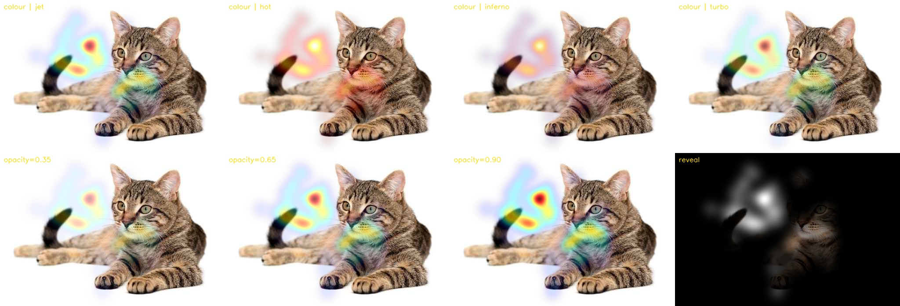
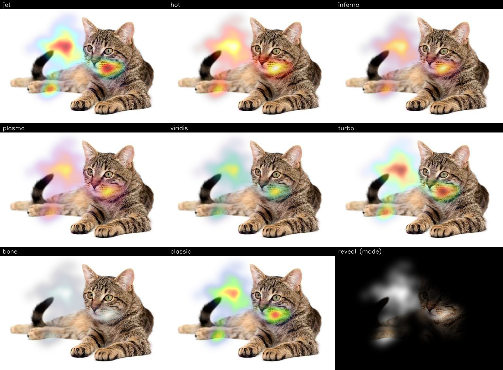

# heatmappy2

Draw image and video heatmaps in Python using OpenCV.



---

## Install

```bash
pip install heatmappy2
```

**Dependencies:** numpy, opencv-python, ffmpeg-python, Pillow, pydantic

---

## Quickstart

### Static image heatmap

```python
import cv2
from heatmappy2.heatmap import Heatmapper, Point

img = cv2.imread("scene.jpg")
points = [Point(x=320, y=240), Point(x=400, y=300, strength=0.8)]

hm = Heatmapper()
result = hm.heatmap_on_img(points, img)
cv2.imwrite("heatmap.jpg", result)
```

### Video heatmap on a static image

```python
from heatmappy2.heatmap import Heatmapper
from heatmappy2.video import VideoHeatmapper, VideoPoint

points = [
    VideoPoint(x=320, y=240, t=0.0),
    VideoPoint(x=400, y=300, t=500.0),
    VideoPoint(x=280, y=200, t=1000.0),
]

vh = VideoHeatmapper(Heatmapper(), decay_time_ms=500.0, smooth_decay=True)
vh.heatmap_on_image(
    base_img=cv2.imread("scene.jpg"),
    points=points,
    output_path="out.mp4",
    duration_ms=2000.0,
    fps=20.0,
)
```

### Video heatmap on a video

```python
vh = VideoHeatmapper(Heatmapper())
vh.heatmap_on_video(
    video_path="input.mp4",
    points=points,
    output_path="out.mp4",
)
```

Audio is preserved automatically if the source video has an audio track.

---

## Heatmapper options

```python
Heatmapper(
    point_diameter=50,        # default kernel diameter in pixels
    point_strength=0.5,       # default kernel peak intensity (0–1)
    sigma=None,               # Gaussian sigma; defaults to diameter / 6
    normalisation="relative", # "relative" | "absolute" | "raw"
    ceiling=None,             # required for absolute normalisation
    min_intensity=0.0,        # floor intensity for non-zero pixels (0–1)
    mode="colour",            # "colour" | "reveal" | "pair"
    colormap="jet",           # see Colormaps section below
    opacity=0.65,             # max heatmap opacity in colour mode (0–1)
)
```

### Modes

| Mode | Output |
|------|--------|
| `"colour"` | Colourised heatmap blended over the base image |
| `"reveal"` | Base image revealed only where attention is high |
| `"pair"` | Colour and reveal side by side (double width) |

### Colormaps

Two families of colormaps are available. Both are passed as the `colormap` string argument.

**Built-in (OpenCV):**

| Name | Character |
|------|-----------|
| `"jet"` | Blue → cyan → green → yellow → red (default) |
| `"hot"` | Black → red → orange → yellow → white |
| `"inferno"` | Black → purple → orange → yellow |
| `"plasma"` | Blue → purple → orange → yellow |
| `"viridis"` | Purple → blue → green → yellow |
| `"turbo"` | Blue → green → yellow → red (perceptually smoother than jet) |
| `"bone"` | Greyscale with a blue tint |

**Custom (ported from v1):**

| Name | Character |
|------|-----------|
| `"classic"` | Red (dense) → green → blue (sparse) — the original heatmappy look |



> **Note:** In v1 the reveal effect was a colormap that relied on PNG alpha transparency. In v2 it is
> a first-class `mode="reveal"` that composites directly and produces cleaner results.

### Normalisation

| Mode | Behaviour |
|------|-----------|
| `"relative"` | Peak point = 255; scales to the most-attended location |
| `"absolute"` | Scaled by `ceiling` (e.g. total participant count); values > ceiling clip to 255 |
| `"raw"` | No normalisation; raw accumulated kernel values clamped to [0, 255] |

---

## Point options

```python
Point(
    x=320,             # pixel coordinate
    y=240,
    diameter=80,       # per-point kernel diameter (overrides Heatmapper default)
    diameter_pct=0.15, # diameter as a fraction of min(width, height) — use instead of diameter
    strength=0.7,      # per-point peak intensity (0–1)
    sigma=10.0,        # per-point Gaussian sigma
)
```

`diameter` and `diameter_pct` are mutually exclusive. Only one may be set per point.

For video, use `VideoPoint(x, y, t)` where `t` is the timestamp in milliseconds.

---

## VideoHeatmapper options

```python
VideoHeatmapper(
    heatmapper,             # a configured Heatmapper instance
    decay_time_ms=None,     # how long (ms) a point persists after its timestamp
    smooth_decay=False,     # if True, intensity fades linearly over decay_time_ms
)
```

### Decay modes

| `decay_time_ms` | `smooth_decay` | Behaviour |
|-----------------|----------------|-----------|
| not set | — | Point appears only in its own frame |
| set | `False` | Full intensity for `decay_time_ms`, then vanishes |
| set | `True` | Linear fade from full intensity to zero over `decay_time_ms` |

### Time windowing

Both `heatmap_on_image` and `heatmap_on_video` accept `start_ms` and `end_ms` to render a sub-window of the full timeline. Points whose decay tail extends into the window from before `start_ms` are automatically included.

```python
vh.heatmap_on_image(..., start_ms=5000.0, end_ms=15000.0)
vh.heatmap_on_video(..., start_ms=10000.0, end_ms=30000.0)
```

---

## Low-level API

### GreyHeatmapper

Renders a greyscale uint8 heatmap without colour compositing. Useful if you want to apply your own colormap or post-process the intensity map directly.

```python
from heatmappy2.heatmap import GreyHeatmapper, Point

hm = GreyHeatmapper(normalisation="absolute", ceiling=50.0)
grey = hm.heatmap(width=1920, height=1080, points=[Point(x=960, y=540)])
```

### GaussianKernel

The kernel generator is exposed directly for inspection or custom use. Kernels are cached by `(diameter, strength, sigma, threshold)`.

```python
from heatmappy2.kernels import GaussianKernel

k = GaussianKernel()
kernel = k.get(diameter=101, strength=0.8, sigma=20)  # float32 numpy array
```

---

## Examples

Example scripts are in [`examples/`](examples/). Run them from the repo root:

```bash
python heatmappy_v2/examples/01_kernel_preview.py   # kernel shapes and sigma comparison
python heatmappy_v2/examples/02_grey_heatmap.py     # greyscale heatmap output
python heatmappy_v2/examples/03_colour_and_reveal.py # colour and reveal modes on a still image
python heatmappy_v2/examples/04_video_on_image.py   # video heatmap over a static image
python heatmappy_v2/examples/05_video_on_video.py   # video heatmap over a video with audio
python heatmappy_v2/examples/06_colormaps.py        # all colormaps side by side
```

Outputs are written to `examples/output/`.

---

## License

MIT License.
